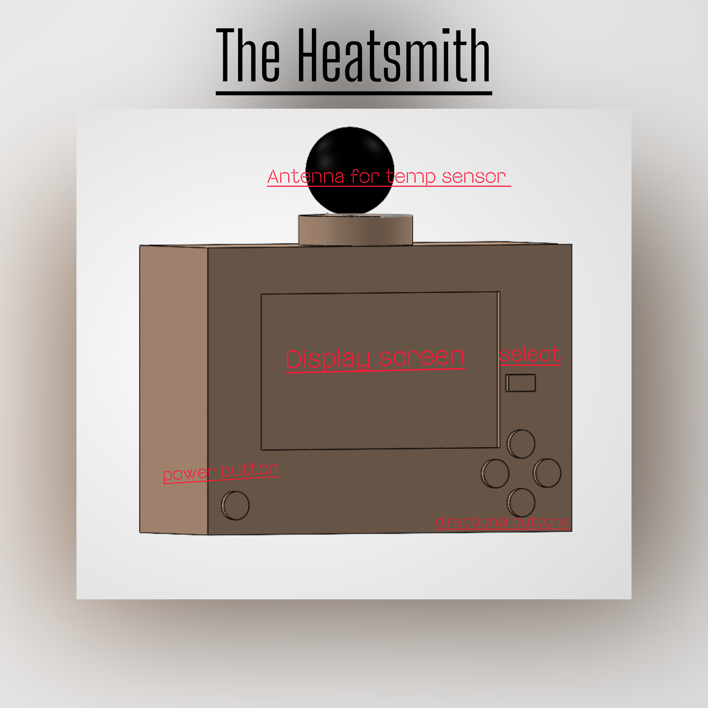
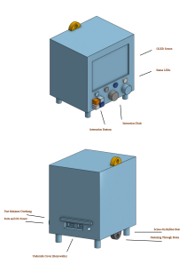

## Overview of Ideation and Concept Generation

This page focuses on exploring different features ideas, and sketches that could help meet the user needs of the HeatSmith. Each user need is paired with several possible features and short descriptions of how they could improve the product. These ideas will help the team compare different options and decide which features would work best in the final design.

## Generating Ideas

To start the process of design ideation, every member was given the opportunity to generate multiple ideas to fulfil key user needs. This resulted in 100 different features that could be used to satisfy these needs, as shown below:

| Requirement / Need | Feature | Detail |
| --- | --- | --- |
| The product provides accurate temperature measurements that users can trust without secondary verification. | Temperature Sensor | The device uses a sensor to show temperature readings. |
| The product provides accurate temperature measurements that users can trust without secondary verification. | Backup Sensors | The device features a set of backup sensors working in tandem on a consensus model to deliver more accurate measurements. |
| The product provides accurate temperature measurements that users can trust without secondary verification. | Measurement Estimation | The device uses sensors of different types alongside clock data to self-verify that measurements make sense. |
| The product provides accurate temperature measurements that users can trust without secondary verification. | Calibration | The device corrects sensor offsets to improve reading accuracy. |
| The product provides accurate temperature measurements that users can trust without secondary verification. | Digital Display | The device uses a practical method to show temperature. |
| The product provides accurate temperature measurements that users can trust without secondary verification. | Error Indicator | The device indicates when the readings are off and requires recalibration. |
| The product provides accurate temperature measurements that users can trust without secondary verification. | Data Averaging | The device provides stable and repeatable measurements. |
| The product provides accurate temperature measurements that users can trust without secondary verification. | Centralized Recalibration | The device automatically connects to external measurement sources for data verification. |
| The product provides accurate temperature measurements that users can trust without secondary verification. | Multi-Paradigm Sensors | The device features multiple sensors that measure the same value through different means, such as having both an analog and digital temperature sensor. |
| The product provides accurate temperature measurements that users can trust without secondary verification. | Data Analysis | The device combines data from multiple sensors to make conclusions and provide active recommendations for the user. |
| The product has a durable build quality. | Rubber Bumpers | The device's edges help reduce damage from drops and impacts. |
| The product has a durable build quality. | ASA Casing | The device uses a UV-resistant and high-impact-resistant material. |
| The product has a durable build quality. | Rounded Construction | The device's frame is built without sharp corners. |
| The product has a durable build quality. | Honeycomb Interior | The device features an interior honeycomb to distribute forces around the entire frame. |
| The product has a durable build quality. | Steel Framing | The device uses a strong internal frame. |
| The product has a durable build quality. | Internal Cushioning | The fragile components of the device are cushioned against falls. |
| The product has a durable build quality. | Screen Shades | The screen is shielded from sunlight by built-in shades when not in use. |
| The product has a durable build quality. | Freely-Suspended Internals | The device's internals are held within a nested box suspended by springs or another method to protect against falls. |
| The product has a durable build quality. | Resistive Touch Screen | The device uses a pressure-based touchscreen. |
| The product has a durable build quality. | Screen Cover | The device uses a protective cover to prevent damage to the display. |
| The product has a durable build quality. | Recessed Buttons | The device's buttons sit in the casing to prevent them from being damaged during impact. |
| The product has a durable build quality. | Dial Control | The device is controlled with dials as an alternative to a touchscreen. |
| The product remains accurate under different environmental conditions, including rain. | Hydrophobic Coating | The device uses a form of ceramic coating to have water bead off of itself. |
| The product remains accurate under different environmental conditions, including rain. | Sensor Cover | The device uses a cover that shields the sensors from getting wet. |
| The product remains accurate under different environmental conditions, including rain. | Ventilation Holes | The device features small holes to allow outside air to circulate. |
| The product remains accurate under different environmental conditions, including rain. | Waterproof Sensor | The device's temperature sensor is protected from direct rain contact. |
| The product remains accurate under different environmental conditions, including rain. | Drainage Holes | The device features holes that allow water to leave the sensor area. |
| The product requires little user intervention after its initial setup. | Sleep Mode | The device reduces power use when full operation is not needed. |
| The product requires little user intervention after its initial setup. | Rechargeable Battery | The device can operate for long periods of time without changing out batteries. |
| The product requires little user intervention after its initial setup. | Memory Storage | The device can remember what the user has set up every time it is used. |
| The product requires little user intervention after its initial setup. | Audio Alert | The device makes a beep when it is in a potentially hazardous environment. |
| The product requires little user intervention after its initial setup. | Phone Notifications | The device sends a notification through an app detailing its status and measurements. |
| The product requires little user intervention after its initial setup. | Auto Sensing | The user does not have to tell the device when to start sensing for new temperature readings. |
| The product requires little user intervention after its initial setup. | Solar Charger | A solar panel keeps the battery charged. |
| The product requires little user intervention after its initial setup. | Auto-Dimming Display | The device dims the display to keep power usage low. |
| The product requires little user intervention after its initial setup. | Automatic Time Sync | The device keeps its time accurate so measurements and records remain accurate. |
| The product requires little user intervention after its initial setup. | Backup Power Source | The device uses a secondary power source in case the primary source fails. |
| The product requires little user intervention after its initial setup. | Self-Calibrating Routine | The device automatically calibrates its sensors to maintain accuracy. |
| Users can focus on the features relevant to their intended application without unnecessary complexity. | Preset Modes | The device can be programmed to detect weather in a certain way with the push of a button. |
| Users can focus on the features relevant to their intended application without unnecessary complexity. | Menu System | The device has functions grouped into categories, allowing users to quickly find what they need. |
| Users can focus on the features relevant to their intended application without unnecessary complexity. | Dedicated Buttons | The device has specific buttons that give direct access to customization. |
| Users can focus on the features relevant to their intended application without unnecessary complexity. | Custom Settings | The device offers a variety of settings tailored to the user's needs. |
| Users can focus on the features relevant to their intended application without unnecessary complexity. | Mode Editor | The user can select any mode and enable or disable certain features within it. |
| The product provides good overall value for its price. | Rechargeable Battery | The device does not require users to regularly purchase disposable batteries. |
| The product provides good overall value for its price. | Power Duty Cycle | The device saves power by limiting consumption while not in active use and turning on periodically to log data. |
| The product provides good overall value for its price. | USB-C Charging | The device can be charged with a common USB-C cable. |
| The product provides good overall value for its price. | Modular Design | Parts can be replaced or repaired rather than requiring an entirely new device. |
| The product provides good overall value for its price. | Prioritized Options | The device uses necessary modes and options without extra features that unnecessarily increase its price. |
| The product provides good overall value for its price. | Durable Casing | The device has longevity while maintaining the strength to function after critical drops. |
| The product has a sleek and easy-to-read interface. | Large Text | The device has a large display that can be read from far away. |
| The product has a sleek and easy-to-read interface. | Secondary Display | The device has an HDMI or USB port for connecting to a secondary display. |
| The product has a sleek and easy-to-read interface. | LCD Display | The device shows both temperature readings and alerts on a digital screen. |
| The product has a sleek and easy-to-read interface. | Icons/Symbols | The device has a variety of icons to show changes in both weather and device status. |
| The product has a sleek and easy-to-read interface. | Backlight | The device can be read in dark environments. |
| The product has a sleek and easy-to-read interface. | Color Display | The device uses various colors to indicate different temperature readings and environmental conditions. |
| The product has a sleek and easy-to-read interface. | Accessibility Options | The device features preset options that accommodate users with colorblindness or those who need a high-contrast display. |
| The product has a sleek and easy-to-read interface. | Sans Serif Font | The device uses an easy-to-read font for users with visual impairments or reading disabilities. |
| The product has a sleek and easy-to-read interface. | 7-Segment LED Display | The device uses a durable and clearly visible display for key measurements. |
| The product tracks and communicates temperature changes and historical temperature values over time. | Graphs | The device features a temperature graph for long-term monitoring of data. |
| The product tracks and communicates temperature changes and historical temperature values over time. | Trend Indicator | The device uses a simple up, down, or flat indicator to show the temperature trend over a set period. |
| The product tracks and communicates temperature changes and historical temperature values over time. | Manual Reset Button | The device allows stored data to be reset if memory becomes full. |
| The product tracks and communicates temperature changes and historical temperature values over time. | Timestamped Records | Temperature readings are recorded with their corresponding time and date. |
| The product tracks and communicates temperature changes and historical temperature values over time. | All-Time Record Memory | The device records temperature information until its available storage is full. |
| The product provides a long useful service life. | UV-Stabilized Plastics | The product's outer shell resists deterioration caused by long-term UV exposure. |
| The product provides a long useful service life. | Solid-State Components | The device avoids moving parts wherever possible to reduce physical wear and tear. |
| The product provides a long useful service life. | Overcharge Protection | The internal battery system prevents degradation by stopping the charging cycle once fully charged. |
| The product provides a long useful service life. | Corrosion Resistance | The internal circuit boards are coated with a protective layer to prevent corrosion over years of use. |
| The product provides a long useful service life. | Right to Repair | The device allows easy access to components and replacements so users can safely repair it. |
| The product resists breaking caused by moisture. | Water-Resistant Casing | The casing uses seals and protective materials to prevent dust and water from entering. |
| The product resists breaking caused by moisture. | Gold-Plated Contacts | The device uses corrosion-resistant contacts to reduce damage caused by moisture. |
| The product resists breaking caused by moisture. | Silica Gel Packets | Moisture-absorbing material helps keep internal components dry. |
| The product resists breaking caused by moisture. | Moisture Indicator | The device alerts the user when moisture levels exceed what the product can safely handle. |
| The product resists breaking caused by moisture. | Water Runoff Shield | The device uses a shield to direct water away from vulnerable areas. |
| The product resists breaking caused by moisture. | Port Caps | The device features flexible port caps for USB and other physical connections. |
| The product is easy to install. | Magnetic Base | The device uses a magnetic base for quick installation. |
| The product is easy to install. | Pre-Applied Adhesive Tape | The device includes adhesive tape for easy installation. |
| The product is easy to install. | Keyhole Slots | The device includes keyhole slots for simple wall mounting. |
| The product is easy to install. | Auto-Pairing Protocol | The device automatically pairs with compatible devices and sensors. |
| The product is easy to install. | Plug-and-Play | The user only needs to turn on the device for it to begin working. |
| The product is easy to install. | Visual Setup Guide | The device features a visual guide for setup and common actions. |
| The product includes a backup power source. | Dual Battery | The device has two batteries so one can act as a backup power source. |
| The product includes a backup power source. | Supercapacitor Backup | A supercapacitor temporarily keeps the device operating during battery swaps or repairs. |
| The product includes a backup power source. | AC Adapter with Failover | The device operates from wall power and automatically switches to an internal battery if wall power fails. |
| The product includes a backup power source. | USB Power Bank Port | The device allows an external power bank to be used as a backup power source. |
| The product includes a backup power source. | Kinetic Generator | Physical movement can generate emergency backup power for the device. |
| The product provides long battery life. | Low-Power Microcontroller | The device uses an efficient microcontroller to reduce power consumption. |
| The product provides long battery life. | E-Paper Screen | The device uses a screen that requires very little power when its displayed information is not changing. |
| The product provides long battery life. | High-Capacity Lithium-Ion Battery | The device uses a high-capacity battery to extend operating time. |
| The product provides long battery life. | Battery Optimizer | The device optimizes battery usage to improve efficiency. |
| The product provides long battery life. | Adaptive Battery Usage | The device adapts power consumption based on how it is being used. |
| The product supports multiple sensors through one main unit. | Split-Screen Display | The display can show information from multiple connected sensor units at once. |
| The product supports multiple sensors through one main unit. | Auto-Scroll Mode | The display automatically cycles through information from different sensors or measurements. |
| The product supports multiple sensors through one main unit. | Sensor Naming Feature | Users can assign names to individual connected sensors for easier identification. |
| The product supports multiple sensors through one main unit. | Expandable Hub | Multiple sensing units can connect to one central unit and share information. |
| The product supports multiple sensors through one main unit. | Phone Notifications | Information from connected sensors can be sent to the user's phone. |
| The product allows users to customize features according to their preferences. | Modular Dashboard | Users can choose which measurements and information appear on the display. |
| The product allows users to customize features according to their preferences. | Toggleable Alerts | Users can enable or disable selected alerts. |
| The product allows users to customize features according to their preferences. | Selectable Units | Users can choose which connected units are active at different times. |
| The product allows users to customize features according to their preferences. | Programmable Sleep Schedule | Users can select times when the device automatically enters sleep mode. |
| The product allows users to customize features according to their preferences. | Interchangeable Faceplates | Users can change the faceplate to personalize the appearance of the device. |

Using Lucidspark, sticky notes were used virtually for these statements with potential feature solutions. Some sticky notes were left in their own category as an "extra idea" category, in case some ideas were to be circled back for later usage.

## Sort, Rank, & Group

Once the brainstorming session concluded, multiple trends came across the 100 user design needs, which required multiple groupings for these statements. While these groups similar to the initial user need statements that didn't involve a design idea to solve these problems, they still give the device a much more clear direction and how it will solve the problems users had with other products. The content below provides a ranking of the six groups from important to least important, along with the rankings of every feature idea in those groups. On an additional note, the "extra ideas" that were documented in the brainstorming stage have found their way into these categories to ensure that all ideas were considered for the sketches that will be shown later.

# 1. Accuracy & Reliability
| Rank | Feature Idea | Feature Detail |
| ---: | --- | --- |
| 1 | Temperature Sensor | The device uses a sensor to show temperature readings. |
| 2 | Calibration | The device corrects sensor offsets to improve reading accuracy. |
| 3 | Data Averaging | The device provides stable and repeatable measurements. |
| 4 | Backup Sensors | The device features a set of backup sensors working in tandem on a consensus model to deliver more accurate measurements. |
| 5 | Error Indicator | The device indicates when readings are inaccurate and recalibration may be required. |
| 6 | Self-Calibrating Routine | The device automatically calibrates sensors to maintain accuracy. |
| 7 | Multi-Paradigm Sensors | The device uses multiple types of sensors to measure the same value through different methods. |
| 8 | Measurement Estimation | The device compares different sensor measurements and clock data to determine whether measurements make sense. |
| 9 | Watchdog Timer | The device automatically restarts measurement processes if the software hangs or freezes. |
| 10 | Centralized Recalibration | The device connects to external measurement sources for data verification. |
| 11 | Waterproof Sensor | The temperature sensor is protected from direct rain contact. |
| 12 | Sensor Cover | The device uses a cover that shields the sensors from getting wet. |
| 13 | Ventilation Holes | The device allows outside air to circulate around the sensing area. |
| 14 | Drainage Holes | The device allows collected water to leave the sensor area. |
| 15 | Hydrophobic Coating | The device uses a water-repelling coating that causes water to bead off its surface. |
| 16 | Backup Capacitor | The device temporarily maintains safety monitoring during power fluctuations. |
| 17 | Data Analysis | The device combines information from multiple sensors to make conclusions and provide recommendations. |
| 18 | Trend Indicator | The device provides a simple up, down, or steady indicator showing temperature trends. |
| 19 | Timestamped Records | Temperature measurements are stored with their corresponding time and date. |
| 20 | Graphs | The device displays temperature changes graphically for long-term monitoring. |
| 21 | All-Time Record Memory | The device records measurements until its available storage is full. |
| 22 | Manual Reset Button | The user can manually reset stored data when necessary. |

---

# 2. Durability & Protection
| Rank | Feature Idea | Feature Detail |
| ---: | --- | --- |
| 1 | ASA Casing | The device uses a UV-resistant and impact-resistant exterior material. |
| 2 | Water-Resistant Casing | The casing prevents water and dust from reaching internal components. |
| 3 | Internal Cushioning | Fragile internal components are cushioned against falls and impacts. |
| 4 | Rubber Bumpers | The edges of the device help reduce damage caused by drops and impacts. |
| 5 | Corrosion Resistance | Internal circuit boards use protective coatings to reduce corrosion over time. |
| 6 | Screen Cover | The device uses a protective cover to prevent damage to the display. |
| 7 | UV-Stabilized Plastics | Exterior materials resist degradation caused by long-term sunlight exposure. |
| 8 | Recessed Buttons | Buttons sit inside the casing to reduce the chance of damage during an impact. |
| 9 | Rounded Construction | The device avoids sharp corners that could become common impact points. |
| 10 | Honeycomb Interior | The internal structure distributes impact forces throughout the frame. |
| 11 | Port Caps | Flexible covers protect USB and other physical ports from water and debris. |
| 12 | Gold-Plated Contacts | Electrical contacts resist corrosion caused by moisture. |
| 13 | Steel Framing | The device uses a strong internal metal frame. |
| 14 | Solid-State Components | The device avoids moving parts wherever possible to reduce physical wear. |
| 15 | Overcharge Protection | The battery system stops charging when full to reduce long-term battery degradation. |
| 16 | Moisture Indicator | The device alerts the user when excessive moisture is detected. |
| 17 | Water Runoff Shield | A shield directs water away from vulnerable portions of the product. |
| 18 | Freely-Suspended Internals | Internal components are suspended to reduce forces transferred during a drop. |
| 19 | Silica Gel Packets | Moisture-absorbing material helps keep internal components dry. |
| 20 | Right to Repair | Internal components can be accessed and replaced instead of requiring complete product replacement. |
| 21 | Mounting Holes | The device includes through-holes, clips, or a stand to improve physical stability. |
| 22 | Screen Shades | Built-in shades protect the display from sunlight when necessary. |
| 23 | Resistive Touch Screen | The device uses a pressure-based touchscreen that can remain functional in different conditions. |
| 24 | Dial Control | Physical dials provide an alternative to touchscreen controls. |

---

# 3. Interface & Alerts
| Rank | Feature Idea | Feature Detail |
| ---: | --- | --- |
| 1 | LCD Display | The device displays temperature measurements and alerts on a digital screen. |
| 2 | Large Text | Important information is displayed using large characters that can be read from farther away. |
| 3 | Icons / Symbols | The interface uses recognizable symbols to communicate weather and device status. |
| 4 | Color Display | Different colors are used to quickly distinguish temperature and environmental conditions. |
| 5 | Accessibility Options | Preset display options support users who require colorblind or high-contrast modes. |
| 6 | Sans Serif Font | The interface uses a simple font that is easier to read for users with visual or reading difficulties. |
| 7 | Backlight | The display remains readable in dark or low-light environments. |
| 8 | Unit Control | Users can switch displayed measurements between Fahrenheit and Celsius. |
| 9 | Audio Alert | The device produces an audible warning when potentially hazardous conditions are detected. |
| 10 | 7-Segment LED Display | Key measurements can be presented using a simple and highly visible display. |
| 11 | Auto-Scroll Mode | The interface automatically cycles through different measurements or sensor information. |
| 12 | Split-Screen Display | Information from multiple sensors can be shown simultaneously on the display. |
| 13 | Secondary Display | An HDMI or USB connection allows information to be shown on an additional display. |

# 4. Controls, Customization & Connectivity
| Rank | Feature Idea | Feature Detail |
| ---: | --- | --- |
| 1 | Preset Modes | The device provides predefined operating modes that can be activated quickly. |
| 2 | Dedicated Buttons | Physical buttons give users direct access to important functions. |
| 3 | Menu System | Device functions are organized into categories that users can navigate. |
| 4 | Custom Settings | Users can change settings according to their individual needs. |
| 5 | Mode Editor | Users can enable or disable specific features within an operating mode. |
| 6 | Toggleable Alerts | Users can enable or disable selected alerts. |
| 7 | Modular Dashboard | Users can select which measurements and information appear on the main interface. |
| 8 | Selectable Units | Users can choose which connected units or sensors are active. |
| 9 | Expandable Hub | Multiple sensing units can connect to one main device and share information. |
| 10 | Sensor Naming Feature | Connected sensors can be given custom names for easier identification. |
| 11 | Phone Notifications | Device information and alerts can be sent to a user's phone. |
| 12 | Programmable Sleep Schedule | Users can select times when the device enters a reduced-power state. |
| 13 | Interchangeable Faceplates | Users can change the exterior faceplate to personalize the appearance of the device. |

# 5. Power & Automation
| Rank | Feature Idea | Feature Detail |
| ---: | --- | --- |
| 1 | Rechargeable Battery | The device operates for extended periods without requiring disposable battery replacements. |
| 2 | Low-Power Microcontroller | The device uses an efficient microcontroller to reduce overall power consumption. |
| 3 | Auto Sensing | The device automatically begins collecting new temperature measurements without user input. |
| 4 | Memory Storage | User settings are retained between uses so they do not need to be entered repeatedly. |
| 5 | Sleep Mode | The device reduces power consumption when full operation is unnecessary. |
| 6 | High-Capacity Lithium-Ion Battery | The device uses a high-capacity rechargeable battery to extend operating time. |
| 7 | Backup Power Source | A secondary power source maintains operation if the primary source fails. |
| 8 | Dual Battery | Two batteries provide redundancy if one battery loses power. |
| 9 | Supercapacitor Backup | A supercapacitor temporarily powers the device during battery swaps or power interruptions. |
| 10 | AC Adapter with Failover | The device normally operates from wall power and switches to an internal battery during an outage. |
| 11 | Battery Optimizer | The system manages battery usage to improve efficiency. |
| 12 | Adaptive Battery Usage | Power consumption changes automatically depending on how the device is being used. |
| 13 | Power Duty Cycle | The device reduces power consumption by activating certain functions only when measurements need to be taken. |
| 14 | Auto-Dimming Display | Display brightness automatically decreases when full brightness is unnecessary. |
| 15 | Solar Charger | A solar panel can recharge the battery and reduce how often the user must manually charge the device. |
| 16 | Automatic Time Sync | The device automatically maintains accurate time information for measurements and records. |
| 17 | USB Power Bank Port | An external USB power bank can be used as an emergency power source. |
| 18 | E-Paper Screen | The display consumes very little power when information is not being updated. |
| 19 | Kinetic Generator | Physical motion can generate limited emergency power for the device. |

---

# 6. Installation & Value
| Rank | Feature Idea | Feature Detail |
| ---: | --- | --- |
| 1 | Plug-and-Play | The device begins functioning with little setup beyond powering it on. |
| 2 | USB-C Charging | The device uses a common charging connection rather than a specialized charger. |
| 3 | Modular Design | Individual components can be replaced or repaired instead of replacing the entire device. |
| 4 | Magnetic Base | The device can be installed quickly on compatible metal surfaces. |
| 5 | Visual Setup Guide | A visual instruction guide explains installation and common device functions. |
| 6 | Auto-Pairing Protocol | Compatible devices and sensors automatically connect during setup. |
| 7 | Durable Casing | A long-lasting enclosure reduces the likelihood that the entire product needs replacement. |
| 8 | Rechargeable Battery | Recharging the existing battery reduces the recurring cost of disposable batteries. |
| 9 | Prioritized Options | The product focuses on useful features rather than adding unnecessary functions that increase cost. |
| 10 | Keyhole Slots | Built-in mounting slots allow the product to be attached to a wall or other surface. |
| 11 | Pre-Applied Adhesive Tape | Adhesive allows installation without additional mounting hardware. |
| 12 | Power Duty Cycle | Reduced energy consumption lowers charging frequency and operating costs. |

By using Lucidspark's "LucidAI", all sticky notes were rewritten into clean charts with the 6 categories, as well as each feature's requirement to fulfil. 

After the rankings and reconsideration for certain ideas were made, it was time to start piecing together 3 different concepts for the HeatSmith. Each concept holds multiple features and a brief explanation as to why it may be a good choice for future development. For additional clarification, this documentation/brainstorming was done through Lucidspark once again.

## Concept Sketches

This section contains three unique sketches that may be considered as the foundation of the product's direction and potential. Each of these sketches contain either a video or photo that dives into their concepts, along with a brief description of their purpose, functionality, and how they serve the user.

**Sketch 1:**

"The sketch in CAD is designed as a simple, handheld device that helps users quickly check environmental conditions and navigate settings without complication. Its main purpose is to measure surrounding temperature conditions, display them clearly, and allow the user to interact with the device through a button interface that's similar to a video game controller. This concept focuses on combining accurate sensing, ease of use, and a clean but familiarly nostalgic interface into one compact product."

**Sketch 2:**

"It is a 3d printed mock up of the overall shape and size of the unit. it shows the outer shell, and gives the user of how big the device is so they know where to put it." 

**Sketch 3:**

"This sketch features the main unit and focuses on the peripherals (Screen, Status LEDs, Buttons, Dials), connection ports (DC Power, Sensors, Screens/Computer) and the mounting surfaces (Screw Fasteners, Rubber legs). The user experience primarily consists of selecting what information to display (Temperature, graphs, connections, etc) and what actions to perform using the buttons, while navigating lists using the dials. The purpose of the dials and buttons is to resist against outdoor conditions that a capacitive touchscreen may not be usable in. The fasteners give the user freedom in deciding where to place the HeatSmith."

## Summary of Documentation & Discussion
For the brainstorming session, every member of the team (Joseph Rivera, Damio Garcia, & Malik Johnson) were involved with this process and met remotely through Discord, due strict availability.  During this time, every member of the team brought in a minimum of 35 unique feature ideas for everyone to discuss and categorize. Before beginning the grouping process, each member gave a quick “label” to what their need meant to them. Whether the label was under “numbers”, “appearance”, or “buttons”, this would lead the group to start putting similar words or similar topics against each other.  Once these small groups were created, every member came together to see if these small groups could be filed under a larger, broader category that defined each feature’s true purpose. This led to six different categories being created to filter and group each sub-section to their designated area.

In order to organize these ideas, Lucidspark was used to organize these groups and to create even broader groups that would ultimately decide the main focus of each need. Inside of Lucidspark, the cloud-based software’s AI was utilized to help clean up ideas that were either repeated, or ideas that didn’t have a clear sense of direction. The AI was also there to generate ideas that weren’t initially brought in, which created a very productive brainstorming session for the team.  The notes and brainstorming documentation was taken by Assignment Leader & Meeting Leader, Joseph Rivera.

The list of requirements for this product were drawn from the previous project assignments, “User Needs & Benchmarking”, and “Product Requirements”. These two project assignments were the basis for figuring out what the most important requirements were going to be for this product, and have been used to create sketched concepts that fulfil these needs.
